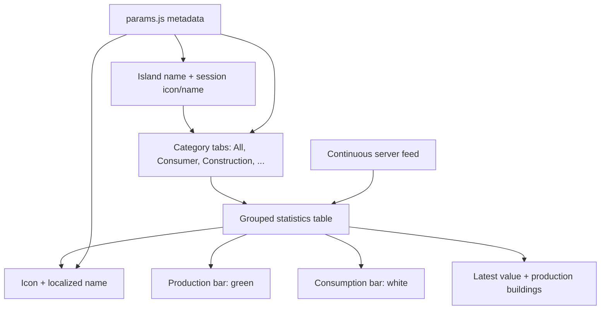
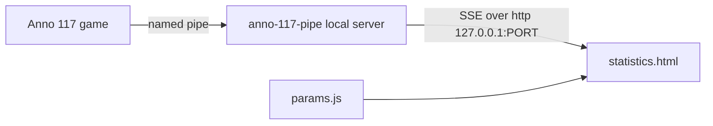
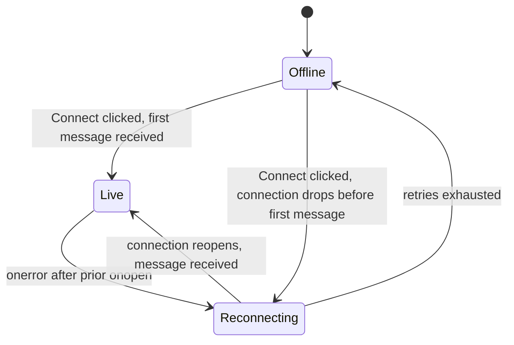

# Live Statistics Page - Plan

## Goal Capsule

- **Objective:** Ship `statistics.html`, a minimal standalone page that continuously displays the latest Anno-style values for every entry in the server's `numEntries` record.
- **Authority hierarchy:** Product Contract requirements (R-IDs) govern product behavior. Planning Contract Key Technical Decisions (KTD-IDs) govern implementation mechanism within those requirements. Implementation Units carry unit-local deltas only.
- **Stop conditions:** Never write to the game or to the calculator's own planning state (`Factory.buildings.constructed`). Never persist page state (tabs, scroll, connected feed) to `localStorage`.
- **Execution profile:** `code`, Standard depth, 6 implementation units.
- **Tail ownership:** This repo's normal PR flow. No cross-repo shipping step — the server half is tracked separately in `../anno-117-pipe` (see `docs/pipe-live-data-integration.md` and the cross-repo handoff cited under Sources & Research).

---

## Product Contract

**Product Contract preservation:** unchanged. Planning added Key Technical Decisions, Implementation Units, Verification Contract, and Definition of Done on top of the original Requirements, Actors, Flows, and Acceptance Examples; no R/A/F/AE was reworded or renumbered.

### Summary

`statistics.html` presents a live, Anno-like table for an island and session, fed by a Server-Sent Events connection to a companion local server. Users switch between category tabs while every entry stays represented by the complete `numEntries` record. The page ships as its own webpack entry point, separate from the main calculator bundle.

### Problem Frame

The calculator needs a quick way to inspect current production statistics without editing configuration or restoring browser state. A static one-time snapshot would become stale, so the page must reflect the server's continuously changing data in place.

### Key Decisions

- **Anno-like grouped table:** Use the selected B direction with tabs and a dense table because it supports scanning the full record while preserving the familiar statistics-page structure. Governs R4, R5, and R6.
- **Live server feed:** Treat each incoming server update as the newest state and update the existing view in place; no persistence or manual refresh is part of this work. Governs R8 through R14.
- **Params-owned presentation metadata:** Resolve names, icons, localization, and session identity from the existing params data instead of duplicating game metadata in the statistics payload. Governs R2 and R7.

### Requirements

**Page and header**

- R1. The page MUST show the current island name supplied by the server.
- R2. The page MUST show the session icon and localized session name resolved from the matching params session record.
- R3. The page MUST be read-only and MUST NOT persist statistics, selected tabs, scroll position, or other page state.

**Complete table and filtering**

- R4. The All tab MUST render one row for every key in the server's `numEntries` record, including entries whose current value is zero.
- R5. The page MUST provide Anno-style category tabs, including All, Consumer, and Construction, plus any additional categories represented by the available params data.
- R6. Selecting a category MUST filter the same complete set of rows without changing row identity or order within that category.
- R7. Each row MUST resolve its icon, localized display name, and stable identity from the matching params entry.

**Live values**

- R8. Each row MUST show the latest numeric value supplied by the server.
- R9. Each row MUST show a green production bar and a white consumption bar using the latest server values.
- R10. Each row MUST show the number of production buildings supplied by the server.
- R11. Incoming updates MUST replace row values in place while preserving the selected tab, row order, and scroll position.

**Connection states**

- R12. The page MUST expose a compact connection state of Live, Reconnecting, or Offline.
- R13. While data is unavailable, the page MUST retain the last displayed values when available and clearly indicate that the feed is not current.
- R14. Invalid or missing numeric values MUST render as zero without preventing other valid rows from updating.

### Actors

- **Viewer:** Reads current island statistics and changes the active category tab.
- **Statistics server:** Continuously provides island identity, session identity, `numEntries` values, production, consumption, and building counts.
- **Params dataset:** Provides localized names, icons, category metadata, and session presentation metadata.

### Key Flows

- F1. **Initial load:** The viewer opens `statistics.html`; the page loads params metadata, connects to the statistics feed, and renders the header plus every `numEntries` row.
- F2. **Filter:** The viewer selects a category tab; the page hides non-matching rows while retaining the same live data model.
- F3. **Live update:** The server sends a new record; the page updates values, bars, and building counts in place without resetting the tab or scroll position.
- F4. **Connection loss:** The feed disconnects; the page changes the connection indicator to Reconnecting or Offline, retains the last values, and resumes live updates when the feed returns.

### Layout Direction

The approved direction is a header followed by tabs and one dense grouped table. Each row places the icon and localized name at left, green production and white consumption bars in the center, and the latest value plus production-building count at right.



### Acceptance Examples

- AE1. **Complete All tab:** Given a `numEntries` record with N keys, when the page is connected, then the All tab contains exactly N rows, including zero-valued entries.
- AE2. **Category filtering:** Given entries in Consumer and Construction, when Construction is selected, then only Construction rows are visible and each visible row retains its params-resolved icon and name.
- AE3. **Live refresh:** Given the viewer is on Consumer with a non-zero scroll position, when the server sends new values, then the visible rows and bars update while Consumer and the scroll position remain selected.
- AE4. **Stale connection:** Given values have been displayed, when the feed disconnects, then the last values remain visible and the connection indicator is Reconnecting or Offline.
- AE5. **Partial invalid data:** Given one entry has an invalid numeric value and other entries are valid, when an update arrives, then the invalid value displays as zero and valid entries still update.

### Scope Boundaries

**Deferred for later**

- Historical charts, time ranges, trend comparisons, exports, and user-configurable thresholds.
- Editing production buildings or statistics from the page.

**Outside this work**

- Local persistence or synchronization with the calculator's existing island configuration.
- Replacing or modifying the canonical params data-generation pipeline.
- The server itself: transport, framing, and the `anno-117-pipe` build are tracked in that sibling repo (see Sources & Research).

### Dependencies / Assumptions

- The server can identify the island and session for each live update and can provide the latest value, production, consumption, and production-building count for each `numEntries` key.
- Each `numEntries` key can be matched to a params product or other displayable entry with an icon path and localized text.
- Existing asset serving makes the params `iconPath` values usable by the standalone page.
- The initial language follows the calculator's current language convention; language switching is not added to this page.
- The `anno-117-pipe` server does not exist yet. Implementation here proceeds against a mocked SSE endpoint (U3, U5 test scenarios); manual end-to-end verification (U6) happens once that server ships.

### Outstanding Questions

**Resolved during planning**

- Live-feed transport and reconnection policy: resolved by KTD1 and KTD5.
- Production/consumption bar normalization scale: resolved by KTD7.
- Category membership for entries with no explicit product filter: resolved by KTD6.

**Deferred (non-blocking)**

- Whether the server can supply a stable identifier that maps an area to a params session/region record is unresolved on the server side (tracked in the `anno-117-pipe` handoff, see Sources & Research). KTD4 specifies the interim client behavior (raw `areaName` header, no session icon/name) so implementation is not blocked on that answer.

---

## Planning Contract

### Key Technical Decisions

- KTD1. **SSE client, explicit connect, no auto-attach.** The page consumes the server feed via `EventSource` against a local HTTP endpoint. The viewer must trigger connection explicitly (a "Connect" control); the page never auto-connects on load. Matches the loopback-only, explicit-opt-in posture already decided for the server side (see Sources & Research). Governs R11, R12.
- KTD2. **Second webpack entry point.** `statistics.html` is a new, hand-authored HTML file loading a new bundle (`statistics.bundle.js`) built from a second webpack entry, mirroring `index.html`'s pattern of loading `params.js`, jQuery, Bootstrap, and Popper as plain global `<script>` tags rather than webpack imports. No existing precedent in this repo for a second entry point; this is new build plumbing.
- KTD3. **Direct params lookups, not full object instantiation.** Icon, localized name, and category resolution read `window.params` directly through small standalone functions, mirroring `NamedElement`'s `iconPath` -> `params.icons` and `locaText[lang]` fallback chain (`src/util.ts:269-336`, `:300-322`), instead of constructing real `Session`/`Product` objects. The page has no `Island`/`assetsMap` to build those objects from.
- KTD4. **Graceful degradation on unresolved identity.** A `ProductGuid` with no params match still renders: a GUID-derived fallback name, a generic icon, and category "Other" — never dropped, preserving R4's completeness. A session identifier with no params match renders the header using the server's raw `areaName` only, with no session icon or localized name. Governs R2, R4, R7.
- KTD5. **Connection state machine.** `Offline` = never yet connected, or reconnection attempts exhausted past a bounded retry window. `Reconnecting` = actively retrying after a previously live connection dropped (`EventSource` `onerror` following a prior `onopen`). `Live` = connection open and at least one message received. A state transition never clears already-displayed row values — display persistence (R13) is independent of connection-state tracking. Governs R12, R13.
- KTD6. **"Other" category fallback.** An entry with no explicit category match in params defaults into an "Other" tab in addition to All, rather than surfacing only in All. Governs R5, R6.
- KTD7. **Bar scale reference.** Each row's green production bar and white consumption bar scale against the maximum of that row's own `perfectGeneration`/`perfectConsumption` values (the 100%-capacity references the server forwards), ensuring both bars are drawn to the same visual scale for direct comparison. Governs R9.
- KTD8. **Predefined row order, filtered view, one persistent array.** Rows are sorted to match the calculator's exact product ordering (defined by their category and product indices in `window.params.productFilters`). Category filtering and sorting read a `pureComputed` filter over one persistent observable array; the array reference is never reassigned. Extends the "never swap the array a foreach iterates" invariant from `src/AGENTS.md`'s Aggregate mode section to this page's own view-model. Governs R6, R11.
- KTD9. **Test scope.** SSE handling, the connection-state machine, and bar rendering are new territory with no existing pattern in this repo, so they get full test coverage: unit tests for the state machine and payload-to-row logic against a mocked `EventSource`, and binding tests for tab filtering and row rendering, following `tests/computed/` and `tests/binding/` conventions.

### High-Level Technical Design

**Component topology.** The game, the `anno-117-pipe` companion server, and this page are three separate processes; only the last two are in scope here.



**Connection state machine (KTD5).**



### Assumptions

None beyond the Dependencies / Assumptions already listed under the Product Contract — no additional agent-inferred bets bypassed user confirmation in this run.

---

## Risks & Dependencies

- **Mixed-content / secure-context restriction.** This site deploys publicly over HTTPS. An `https://` page connecting to a plain `http://127.0.0.1:PORT` `EventSource` may be blocked by browser mixed-content or Private Network Access policy, depending on browser and version. Verify this works in the target browsers (current Chrome and Firefox) before relying on it; if blocked, the server side needs to revisit its transport choice (see the cross-repo handoff under Sources & Research). This was flagged as an open concern in `docs/pipe-live-data-integration.md` and is not yet resolved by either side.
- **External server dependency.** The `anno-117-pipe` server does not exist yet (see Dependencies / Assumptions). This plan's units build and test against a mocked SSE endpoint; U6's manual walkthrough needs a running server (real or mocked) to execute.
- **Unofficial game feature.** The pipe protocol is explicitly unofficial and experimental; its shape may change across game versions. This plan has no mitigation for that beyond what the server side already does (version negotiation, per the cross-repo handoff) — a protocol break on the server side would surface here as a stalled or malformed feed, already handled by KTD5's Offline state and KTD4's fallback rendering.

---

## Implementation Units

### U1. Second webpack entry point and statistics.html scaffold

**Goal:** Stand up build plumbing so `statistics.html` builds as its own bundle, separate from the main calculator.

**Requirements:** R1, R2, R3; KTD2

**Dependencies:** none

**Files:**
- `webpack.config.js` (modify)
- `statistics.html` (new, repo root)
- `src/statistics.ts` (new)

**Approach:**
1. Add a second entry to `webpack.config.js`: `statistics: './src/statistics.ts'`, with `output.filename` templated per entry (`[name].bundle.js`) so the existing `calculator.bundle.js` output name is unchanged.
2. Author `statistics.html` mirroring `index.html`'s `<head>`: the same CDN `<script>` tags for jQuery, Bootstrap, and Popper, and a plain global `<script src="./js/params.js">` tag (not a webpack import), then `<script src="./dist/statistics.bundle.js">`.
3. `src/statistics.ts` starts minimal: confirm `window.params` is present, initialize an empty Knockout root view-model placeholder for later units to extend.

**Patterns to follow:** `index.html`'s script-tag structure (jQuery/Bootstrap/Popper as CDN globals, `params.js` as a plain global script, not a module import).

**Execution note:** This is packaging/config; prove it with a build and a manual load smoke check rather than unit coverage.

**Test scenarios:**
- Test expectation: none — pure scaffolding, no behavior yet.

**Verification:** `npm run build` succeeds and emits both `dist/calculator.bundle.js` and `dist/statistics.bundle.js`; opening `statistics.html` in a browser shows no console errors.

---

### U2. Params-driven identity resolution

**Goal:** Standalone lookup functions resolving product and session icon, localized name, and category from `window.params` by numeric GUID, with graceful fallback.

**Requirements:** R2, R5, R7; KTD3, KTD4, KTD6

**Dependencies:** U1

**Files:**
- `src/statistics-params.ts` (new)
- `tests/computed/statistics-params-resolution.spec.ts` (new)

**Approach:**
1. Export `resolveProduct(guid)`, `resolveSession(identifier)`, and category-lookup helpers reading directly from `window.params` collections.
2. Mirror `NamedElement`'s two lookups (`src/util.ts:300-322`): `iconPath` -> `window.params.icons[...]`, `locaText[currentLanguage]` falling back to `locaText.english`, falling back to the raw config name.
3. On no match, apply KTD4: `resolveProduct` returns a fallback record (GUID-derived name, generic icon, category "Other"); `resolveSession` returns `null`.

**Patterns to follow:** `src/util.ts` `NamedElement` icon/locaText resolution (`src/util.ts:269-336`); `src/i18n.ts` `texts`/`languageCodes` as framework-agnostic data.

**Test scenarios:**
- Happy path: a known `ProductGuid` resolves icon path, localized name in the current language, and its params category.
- Happy path: language falls back to English when the current language has no `locaText` entry, mirroring `NamedElement`.
- Edge case: an unmatched `ProductGuid` returns the KTD4 fallback record (GUID-derived name, generic icon, category "Other") instead of throwing or returning `undefined`.
- Edge case: an unresolvable session identifier returns `null`.

**Verification:** `npm run test:computed` passes; no fallback path throws.

---

### U3. Statistics feed client and row data model

**Goal:** The SSE client and the Knockout view-model holding live `numEntries` rows and connection state.

**Requirements:** R8, R9, R10, R11, R12, R13, R14; KTD1, KTD5, KTD7, KTD8

**Dependencies:** U1, U2

**Files:**
- `src/statistics-feed.ts` (new)
- `src/statistics.ts` (modify)
- `tests/computed/statistics-connection-state.spec.ts` (new)
- `tests/computed/statistics-row-model.spec.ts` (new)

**Approach:**
1. `statistics-feed.ts` wraps `EventSource` with an explicit `connect()` (never called automatically) and an observable `connectionState` implementing KTD5's state machine.
2. One persistent Knockout `observableArray` of row view-models keyed by `ProductGuid`, first-seen order (KTD8, no reassignment).
3. On each incoming message: find or create the row for each entry's `ProductGuid` (append new rows, never reorder existing ones), update its generation/consumption/perfect-reference/building-count observables in place, coerce invalid or missing numeric fields to zero per R14, and set `connectionState` to `live`.
4. Row view-models compose U2's `resolveProduct` for identity.

**Technical design (directional):**
```
onmessage(payload):
  for entry in payload.entries:
    row = rows.find(entry.productGuid)
    if not row:
      row = createRow(entry.productGuid)  // resolves identity via U2
      rows.push(row)                       // append, never reorder
    row.generation(toNumberOrZero(entry.generation))
    row.consumption(toNumberOrZero(entry.consumption))
    row.perfectGeneration(toNumberOrZero(entry.perfectGeneration))
    row.perfectConsumption(toNumberOrZero(entry.perfectConsumption))
    row.buildings(toNumberOrZero(entry.buildings))
  connectionState('live')
```

**Patterns to follow:** `src/AGENTS.md` Aggregate mode's "never swap the array a foreach iterates" invariant, applied to this page's own row array.

**Test scenarios:**
- Happy path: the first message populates one row per entry key, values matching the payload (Covers AE1).
- Happy path: a second message updates existing row values in place without changing array length or order (Covers AE3).
- Edge case: an entry with an invalid or missing numeric value renders that field as zero; other entries in the same message still update (Covers AE5).
- Edge case: `EventSource` `onerror` firing after a prior `onopen` transitions `connectionState` to `reconnecting`.
- Edge case: sustained failure past the retry threshold transitions `connectionState` to `offline`.
- Edge case: `EventSource` that has never opened stays `offline`, never `reconnecting`.
- Integration: a disconnect-shaped event does not clear existing row values (Covers AE4).

**Verification:** `npm run test:computed` passes for the state machine and row-update logic against a mocked `EventSource`.

---

### U4. Header, tabs, and table UI

**Goal:** Render the page shell: header, category tabs, and the dense row table with production/consumption bars.

**Requirements:** R1, R2, R4, R5, R6, R7, R9, R10; KTD2, KTD6, KTD8

**Dependencies:** U2, U3

**Files:**
- `statistics.html` (modify)
- `templates/statistics-table.html` (new)
- `style.css` (modify)
- `src/statistics.ts` (modify)

**Approach:**
1. Header binds the island name from the raw server `areaName`, plus session icon/localized name when U2's `resolveSession` succeeds (KTD4 fallback otherwise).
2. Tabs follow the existing Bootstrap pattern in `templates/product-config-dialog.html:81-116`: `data-toggle="tab"` + `data-target`, a single `active` class at init, Knockout `css: {active: ...}` bound to a `selectedCategory` observable, no manual click handler.
3. Table renders through one `<!-- ko foreach -->` over a `pureComputed` filtering U3's persistent row array by `selectedCategory` (KTD8: never reassign the underlying array).
4. Bars are new markup: two `<div>` fills (green production, white consumption) with bound `width: %` styles scaled against `perfectGeneration`/`perfectConsumption` (KTD7), following the `.product-tile-amount`/`.product-tile-load` naming convention in `style.css`.

**Patterns to follow:** `templates/product-config-dialog.html:81-116` (tabs); `style.css` `.product-tile-amount`/`.product-tile-load` (bar styling vocabulary).

**Test scenarios:**
- Happy path: the All tab shows one row per entry in the current data model, including zero-valued entries (Covers AE1).
- Happy path: selecting Construction shows only Construction-category rows, each with its params-resolved icon and name (Covers AE2).
- Happy path: a live update changes visible row values and bar widths while the selected tab and scroll position remain unchanged (Covers AE3).
- Edge case: an entry falling back to category "Other" (per U2/KTD4) appears in both All and the Other tab.
- Integration: switching tabs does not change row order and does not disrupt the next SSE update's in-place behavior.

**Verification:** `npm run test:binding` passes; manual smoke check confirms bar widths match known generation-to-perfect-generation ratios.

---

### U5. Connection indicator and connect/disconnect UX

**Goal:** Wire the compact connection-state indicator and the explicit Connect action; define cold-start and disconnect rendering.

**Requirements:** R3, R11, R12, R13, R14; KTD1, KTD5

**Dependencies:** U3, U4

**Files:**
- `statistics.html` (modify)
- `src/statistics.ts` (modify)
- `tests/binding/statistics-connection-indicator.spec.ts` (new)

**Approach:**
1. An explicit "Connect to running game" control calls U3's `connect()`; nothing connects automatically on page load (KTD1).
2. Indicator text and style bind to U3's `connectionState` (`live` / `reconnecting` / `offline`).
3. Before the Connect action or before the first message arrives, the table renders empty and the indicator shows `offline` — not an error state (KTD5 cold-start default).

**Test scenarios:**
- Happy path: clicking Connect transitions the indicator from Offline to Live once the first message arrives.
- Edge case: page loaded but Connect not yet clicked shows Offline and an empty table, with no error rendering.
- Edge case: a connection drop after data has rendered keeps the last values visible and flips the indicator to Reconnecting, then Offline once retries are exhausted (Covers AE4).

**Verification:** `npm run test:binding` passes; manual smoke check against a mocked SSE endpoint confirms all three state transitions.

---

### U6. End-to-end verification pass

**Goal:** Confirm the assembled page satisfies all acceptance examples together, not just per-unit.

**Requirements:** AE1, AE2, AE3, AE4, AE5; all R-IDs

**Dependencies:** U1, U2, U3, U4, U5

**Files:** none new.

**Approach:**
1. Run the full build and test suite.
2. Load `statistics.html` against a mocked (or, once available, real) SSE source and walk AE1 through AE5 manually.

**Execution note:** This is an integration and smoke pass, not new unit coverage — confirm the assembled page against a mocked feed rather than inventing redundant tests.

**Test scenarios:**
- Covers AE1 through AE5, already exercised individually by U3-U5's test scenarios; this unit confirms they hold together on the assembled page.

**Verification:** `npm run build`, `npm run type-check`, and `npx playwright test --reporter=list` all pass; manual walkthrough of AE1-AE5 confirms no regressions.

---

## Verification Contract

| Command | Applies to | Purpose |
|---|---|---|
| `npm run build` | U1, U6 | Confirms both webpack entries compile (MANDATORY before running tests, per `AGENTS.md`) |
| `npm run type-check` | All units | TypeScript validation across new files |
| `npm run test:computed` | U2, U3 | Calculation/data-model tests (`tests/computed/`) |
| `npm run test:binding` | U4, U5 | Template binding tests (`tests/binding/`) |
| `npx playwright test --reporter=list` | U6 | Full non-interactive suite run; never run all tests concurrently (per `AGENTS.md`) |

---

## Definition of Done

**Global:**
- `npm run build`, `npm run type-check`, and the full Playwright suite (`--reporter=list`) all pass.
- All AE1-AE5 hold on the assembled page (U6).
- `dist/calculator.bundle.js` and `dist/statistics.bundle.js` are not committed outside a release, per `AGENTS.md`.
- No dead-end mock-server or experimental SSE-client code left in the diff from approaches explored and abandoned during implementation.

**Per unit:** each unit's own Verification field, above.

---

## Sources & Research

- `src/util.ts:269-336` — `NamedElement` icon/locaText resolution pattern (basis for KTD3, U2).
- `src/i18n.ts:4-19` — `texts`/`languageCodes` as framework-agnostic data usable outside the main Knockout view-model.
- `templates/product-config-dialog.html:81-116` — the repo's one existing Bootstrap tab implementation (basis for U4's tab approach).
- `src/AGENTS.md`, Aggregate mode section — read-only data-contract pattern and the "never swap the array a foreach iterates" invariant (basis for KTD8).
- `webpack.config.js`, `index.html` — confirmed single-entry build with `params.js`/jQuery/Bootstrap loaded as globals, not modules (basis for KTD2).
- `docs/pipe-live-data-integration.md` (this repo) — wire-protocol grounding: `AreaProductionStatistics` fields, GUID-space sharing with `assetsMap`, and the mixed-content/HTTPS risk noted under Risks & Dependencies.
- Cross-repo handoff: `../anno-117-pipe/docs/live-statistics-server-handoff.md` — the server-side requirements this plan's client assumes (SSE transport, versioned payload, `perfectGeneration`/`perfectConsumption` as the bar-scale reference).
- Cross-repo ideation: `../anno-117-pipe/docs/ideation/2026-08-10-calculator-integration-ideation.html` — ranked architecture options; survivor #1 (local server, no Tauri) and survivor #5 (loopback + explicit opt-in) ground KTD1.
