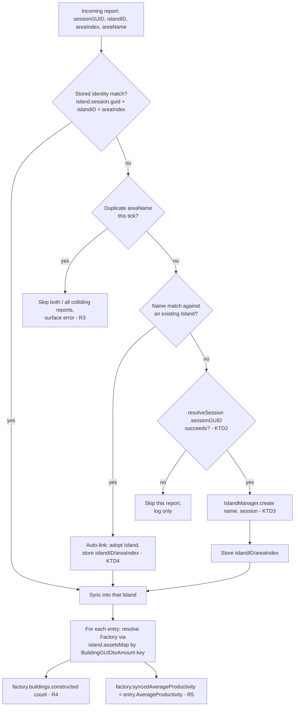

# Game Connector - Plan

## Goal Capsule

- **Objective:** let the calculator's own persistent planning data (islands, factories, building counts)
  be populated and kept in sync from a running Anno 117 session, via `anno-117-pipe`'s local server —
  without disturbing the existing, separate, read-only Live Statistics page.
- **Product authority:** this document is the shared source of truth for both repos/branches involved.
  Neither side should invent requirements the other hasn't agreed to here.
- **Open blockers:** the exact local API/wire contract on the `anno-117-pipe` side is owned by another
  agent working on that repo's `calculator-connector` branch — not decided in this document (see
  "Interface Contract" below for what the calculator side needs from it, not how it's built).

## Repo & Branch Map

| Repo | Branch | Status | Who edits it |
|---|---|---|---|
| `anno-117-calculator` | `game-connector` | Created from `main`; carries the already-shipped Live Statistics page (cherry-picked from `feat/live-statistics-page`, verified byte-identical tree, verified no commit touches `js/params.js`/`params.schema.json`/`types.config.ts`/`js/params-ref.js`) | This repo/session |
| `anno-117-pipe` | `calculator-connector` | Not yet created | A different agent — **not edited from here** |

Both features (statistics page, game connector) live on the calculator's single `game-connector` branch
as **two separate sites** (`statistics.html` vs. `index.html`) — not merged UI, not sharing a page. The
statistics page's own scope, code, and design are frozen; this plan does not modify it.

## Problem & Outcome

Today, every building count in the calculator is entered by hand. A player who wants the calculator to
reflect their actual save has to recount buildings after every change. `anno-117-pipe`'s local game data
(protocol v2, see `docs/pipe-live-data-integration.md`) already reports live building counts per building
type per island. The outcome: a "Connect" action that turns that live feed into the calculator's own
building counts automatically, for islands the player is actively playing.

## Scope

**In scope:**
- A single, global Connect/Disconnect control (new top-level UI element, not inside an existing dialog).
- Matching live game islands to calculator islands (by name), auto-creating calculator islands that don't
  exist yet, and refusing to sync islands whose names collide.
- Writing live building counts into `Factory.buildings.constructed` for matched/created islands.
- Storing and displaying live `AverageProductivity` per factory, bracketed next to the calculator's own
  computed productivity.
- The interface contract the calculator needs from the pipe app's local server (not that server's
  implementation).

**Out of scope:**
- Any change to the shipped Live Statistics page (`statistics.html`, `src/statistics-feed.ts`,
  `src/statistics-params.ts`, `src/statistics.ts`) or its transport.
- `TotalMaintenance`/`TotalIncome`/`TotalProfit`/`WorkforceGUIDtoAmount` — no domain model exists for
  currency or workforce-by-building today; not introduced by this feature.
- Implementing anything inside `anno-117-pipe` (owned by the other agent on `calculator-connector`).
- Merging the statistics page and the main calculator UI into one page.

## Requirements

### R1 — Connect control (calculator, `game-connector`)
A single global Connect/Disconnect control, in a new top-level UI element (e.g. navbar), shows connection
state (mirroring the statistics page's Live/Reconnecting/Offline vocabulary is a reasonable default, not
mandated). One connection serves every island the pipe reports — there is no per-island connect action.

### R2 — Identity & matching (calculator, `game-connector`)
On first successfully synced report for a game island, the calculator stores `islandID` and `areaIndex`
directly on the matched/created `Island`. **No separate `sessionGUID` field is stored** — every `Island`
already carries a `Session` object (`island.session`), and `Session.guid` already *is* the value the
pipe's `sessionGUID` resolves to (confirmed: `resolveSession()` in `src/statistics-params.ts` already
matches a numeric identifier against `params.sessions[].guid`). Session identity for matching is read from
the existing `island.session.guid` at match time, never duplicated into a new stored field.

Matching order per incoming game island:
1. If a calculator `Island` already has stored `(islandID, areaIndex)` matching this report **and** its
   `session.guid` matches the report's `sessionGUID` → that's the island; sync into it.
2. Otherwise, match by name against existing calculator islands (no session/region check) → **auto-link**:
   adopt that island, store its `islandID`/`areaIndex` now.
3. No name match → **auto-create**: resolve `sessionGUID` to a `Session` via `params.sessions[].guid`,
   construct a new `Island` with that session, then store `islandID`/`areaIndex` on it.

### R3 — Duplicate-name refusal (calculator, `game-connector`)
If two live game islands report the same name, neither is synced. The connector surfaces an error
identifying the colliding name(s) (exact UI placement — inline near the Connect control vs. a toast — is
left to planning, not decided here).

### R4 — Live building-count sync (calculator, `game-connector`)
A connector class receives each incoming report and, per entry's `BuildingGUIDtoAmount` map, resolves the
matching `Factory` in the island's `assetsMap` by building GUID and calls
`factory.buildings.constructed(count)` directly — the same write path a manual edit already uses. No new
`BuildingsCalc` implementation, no read-only gating, no UI change to the building-count input.

**Sync always wins, unconditionally, with no effect on editability:** every incoming report overwrites
`constructed` again, regardless of whether the user typed something else in between. The input stays
exactly as editable as any manual island's — the connector is just an automated writer using the existing
setter. Disconnecting has **no immediate effect on editability**, because editability was never changed by
being connected in the first place; disconnecting simply means the connector stops writing.

A game island reporting more than one `BuildingGUIDtoAmount` key for what the calculator considers one
`Product` (i.e. multiple factory types) is written as separate calls, one per building GUID — no
splitting/weighting heuristic needed (protocol v2 resolved this; see `docs/pipe-live-data-integration.md` §3).

### R5 — Productivity display (calculator, `game-connector`)
Each synced entry's `AverageProductivity` (product-level, not per-factory-type — the pipe has no
per-building-type productivity breakdown) is stored and shown in brackets next to the calculator's own
computed productivity, on every factory row for that product. A product with multiple factory types shows
the identical bracketed number on each of its rows.

### R6 — Interface contract needed from `anno-117-pipe` (cross-repo, informs `calculator-connector`)
The calculator side needs, per connection tick, per island: the same shape already flowing for the
statistics feature — `sessionGUID`, `islandID`, `areaIndex`, `areaName`, and entries carrying `ProductGuid`,
`BuildingGUIDtoAmount`, and `AverageProductivity` at minimum. **No new wire format is required beyond
protocol v2's existing fields** — the statistics page's own transport precedent (embedded loopback
HTTP/SSE server, `src/statistics_server.cpp`) already carries this; whether game-connector reuses that
exact stream or a new endpoint is the other agent's call on `calculator-connector`, not decided here.

### R7 — Pipe app hosts the full calculator (cross-repo, informs `calculator-connector`)
Per the stated goal, `anno-117-pipe` becomes a standalone desktop app that embeds the calculator (e.g. as a
git submodule) and serves it same-origin via localhost — extending the existing `--calculator-dir`
sibling-serving precedent (currently only serving `statistics.html`/`dist/`) to serve the full app
(`index.html` included) so the new Connect control has a same-origin local API to call. This is
`anno-117-pipe`-side implementation work, not decided or built here.

## Resolved: Release/build coupling

`AGENTS.md`'s "`dist/calculator.bundle.js` only committed at release" convention is **not special-cased**
for this feature: `game-connector` gets its own release-and-publish pass, the same as any other branch,
and `dist/` is committed as part of that. `anno-117-pipe`'s submodule pin (R7) points at that released
commit — it never needs to build the calculator itself or pin to a dist-less source commit.

## Open Questions (for planning / the pipe-side agent — not resolved here)

1. Exact UI placement/wording for the duplicate-name error (R3).
2. Whether auto-link-by-name (R2 step 2) should also check the existing island's assigned session/region
   against the incoming `sessionGUID` before linking, or accept a cross-region name collision as-is (current
   design: name-only, consistent with R3 treating name as the sole game-side identity key). Not re-opened
   during brainstorming; noted here as an accepted edge case rather than a decided validation rule.

## Non-Goals

- No currency/maintenance/profit modeling (`TotalMaintenance`/`TotalIncome`/`TotalProfit`).
- No workforce-by-building modeling (`WorkforceGUIDtoAmount`) — not used by this feature.
- No changes to the Live Statistics page or its transport.
- No merging of `statistics.html` and `index.html` into one page.

---

## Product Contract Preservation

Product Contract unchanged — R1–R7, "Resolved: Release/build coupling", and both Open Questions above are
preserved verbatim from the `ce-brainstorm` pass. This section only adds the HOW: implementation units,
key technical decisions, and verification for this repo's own scope (R1–R5). R6/R7 remain external
contracts this repo consumes, not built here.

## Key Technical Decisions

**KTD1 — New standalone module, no shared code with the statistics feature.**
`src/game-connector.ts` is a new file. It does not import from or modify `src/statistics-feed.ts`,
`src/statistics-params.ts`, or `src/statistics.ts`. Rationale: those files are explicitly frozen scope
(see Non-Goals); a shared dependency would couple two features that must be able to evolve independently
now that they ship together on one branch.

**KTD2 — Reuse `src/statistics-params.ts`'s `resolveSession()` by import, not duplication.**
`resolveSession(sessionGuid)` is a pure, side-effect-free lookup (`params.sessions[].guid` match) with no
coupling to the statistics feature's state. Importing it is lower-risk than re-implementing the same
lookup a second time and having the two drift. If `resolveSession()` returns `null` (no matching session),
the connector skips that island's report entirely for this tick — no partial/guessed-session island is
ever created — and logs the failure to the console. This is a new edge case not covered by the original
Product Contract; recorded here as the resolved default rather than re-opening brainstorming.

**KTD3 — Auto-create goes through `IslandManager.create(name, session)` (`src/world.ts:374`), never
`new Island(...)` directly.** `create()` already handles pushing to `view.islands`, `sortIslands()`, and
applying the `activateAllNeeds` default — reusing it keeps auto-created islands behaviorally identical to
manually-created ones.

**KTD4 — Identity storage reuses the existing per-island `Storage` mechanism**, not a new SubStorage.
Two new keys, `gameConnector.islandID` / `gameConnector.areaIndex`, set once per island the same way
`Island`'s constructor already does `this.storage.setItem("session", ...)` (`src/world.ts:609`). No new
storage class or global key needed.

**KTD5 — `AverageProductivity` lands in a new transient, non-persisted observable on `Factory`.**
`Factory.syncedAverageProductivity: KnockoutObservable<number | null>`, default `null`. Not persisted to
`Storage` — it's live game state, not a planning input, so it resets to `null` on disconnect and is
re-populated on the next successful sync. `FactoryPresenter` exposes it by delegating to `instance()`,
matching the existing delegation pattern used for every other presenter-to-Factory property (see
`src/AGENTS.md` "Observable vs Direct Reference Guidelines").

**KTD6 — Connect control and duplicate-name error are inline navbar-area UI, not a dialog.**
Follows the existing `icon-navbar` pattern (`index.html:120-168`) rather than introducing a new modal —
consistent with R1's "single global control" framing (a persistent, always-visible affordance, not
something buried behind a dialog open).

**KTD7 — Endpoint resolved: reuse the existing `/statistics` SSE endpoint (Option A), not a dedicated
`/game-connector` endpoint.** Originally a placeholder constant pending `anno-117-pipe`'s R6 decision;
resolved once `anno-117-pipe`'s own plan (`docs/plans/2026-09-20-001-feat-game-connector-plan.md` in that
repo, KTD-P2) recommended reusing `/statistics` rather than adding a second endpoint. Confirmed live
against the running server (`127.0.0.1:53117/statistics`) that its payload already carries
`buildingsByGuid`, `averageProductivity`, and `sessionGuid` under those exact lowerCamelCase JSON keys —
matching `BuildStatisticsPayload()`'s actual output, not the PascalCase C++ struct field names in
`docs/pipe-live-data-integration.md` §3. `src/game-connector.ts` exports `GAME_CONNECTOR_ENDPOINT` (no
longer `_TBD`) pointing at that URL, and its payload-parsing interfaces use the confirmed field names.

## High-Level Technical Design

Matching order per incoming report (R2), the highest-branching piece of logic in this plan:

## Implementation Units

### U1. GameConnector module skeleton and connection lifecycle
**Goal:** stand up `src/game-connector.ts` with the incoming-report type shape and a connection-state
machine, independent of the statistics feature.
**Requirements:** R1, R6 (consumer side)
**Dependencies:** none
**Files:** `src/game-connector.ts` (new), `tests/computed/game-connector-connection.spec.ts` (new)
**Approach:** Model the connection lifecycle (`Disconnected` / `Connecting` / `Connected` / `Reconnecting`
/ `Offline`) after the state vocabulary already established by the statistics page, but as an independent
implementation (KTD1) — do not import `src/statistics-feed.ts`. `connect()` opens the transport to
`GAME_CONNECTOR_ENDPOINT` (KTD7); `disconnect()` tears it down and resets `syncedAverageProductivity`
on every Factory this connector has touched (see U4) back to `null`, per R4's "no effect on editability"
— building counts are **not** reverted, only the transient productivity bracket clears.
**Test scenarios:**
- Happy path: `connect()` transitions state `Disconnected → Connecting → Connected` on a successful open.
- Edge case: a transport error while connected transitions to `Reconnecting`, then `Offline` after
  exhausting retries (mirror whatever retry/backoff shape the statistics page's own client uses, as a
  starting point — not a shared implementation).
- `disconnect()` while connected returns state to `Disconnected` and clears every touched Factory's
  `syncedAverageProductivity`, without touching `buildings.constructed`.
**Verification:** unit tests pass against a mocked transport (reuse `tests/helpers/mock-event-source.ts`'s
existing pattern if the transport is SSE-shaped; otherwise an equivalent local mock).

### U2. Session and island matching
**Goal:** implement the R2 matching order end-to-end.
**Requirements:** R2
**Dependencies:** U1
**Files:** `src/game-connector.ts`, `tests/computed/game-connector-matching.spec.ts` (new)
**Approach:** Per incoming report: (1) look for an `Island` in `window.view.islands()` with stored
`gameConnector.islandID`/`gameConnector.areaIndex` matching, **and** `island.session.guid` equal to
`resolveSession(report.sessionGUID)?.guid` (KTD2) — if found, that's the target. (2) Otherwise, look for a
name match (`island.name() === report.areaName`, excluding `isAllIslands()`) — auto-link, store identity
now (KTD4). (3) Otherwise, resolve the session (KTD2); if it resolves, `IslandManager.create(...)`
(KTD3) and store identity; if it doesn't resolve, skip this report for this tick (KTD2).
**Test scenarios:**
- Happy path: a report matching a previously-stored identity syncs into that island without re-checking
  the name.
- Happy path: a report with no stored identity but a name match against an existing island auto-links and
  persists identity from that point on.
- Happy path: a report with no identity or name match creates a new Island via `IslandManager.create` with
  the resolved `Session`.
- Edge case: `resolveSession` returns `null` for an unrecognized `sessionGUID` — the report is skipped,
  no island is created, no exception is thrown.
- Edge case: a stored-identity match takes priority even when the island has since been renamed (so the
  name no longer matches `report.areaName`) — matching by stored identity does not require the name to
  still agree.
**Verification:** computed tests pass against a set of mocked `window.view.islands()`.

### U3. Duplicate-name refusal and error UI
**Goal:** implement R3.
**Requirements:** R3
**Dependencies:** U2
**Files:** `src/game-connector.ts`, `index.html` (new error element near the navbar control), `src/i18n.ts`
(new key for the error message, 12 languages), `tests/binding/game-connector-duplicate-name.spec.ts` (new)
**Approach:** Within one report batch/tick, group incoming reports by `areaName`; any name shared by 2+
reports with distinct `(sessionGUID, islandID)` is excluded from matching entirely for that tick (none of
the colliding islands sync), and the colliding names populate an observable array the navbar-area element
renders as a small dismissible list. The error list is derived per-tick — a name that stops colliding on a
later tick clears automatically; explicit dismissal only hides the current tick's message early.
**Test scenarios:**
- Happy path: two distinct-identity reports sharing one `areaName` in the same tick — neither syncs, the
  error names that island.
- Edge case: the same island's own re-report (identical `sessionGUID`+`islandID`, e.g. two ticks arriving
  close together) is not treated as a collision with itself.
- Happy path: dismissing the error hides it; a later tick with no collision does not resurface it.
**Verification:** binding test confirms the error DOM appears/disappears per the above.

### U4. Building-count and productivity write path
**Goal:** implement R4 and R5.
**Requirements:** R4, R5
**Dependencies:** U2
**Files:** `src/factories.ts` (add `syncedAverageProductivity: KnockoutObservable<number | null>` to
`Factory`, KTD5), `src/presenters.ts` (expose it on `FactoryPresenter` via `instance()` delegation),
`templates/factory-config-section.html` (bracketed value next to the existing productivity display at
line ~51), `src/i18n.ts` (tooltip text key), `src/game-connector.ts` (write logic),
`tests/computed/game-connector-building-sync.spec.ts` (new),
`tests/binding/game-connector-productivity-display.spec.ts` (new)
**Approach:** for each entry in a matched island's report, for each `(buildingGuid, count)` pair in
`BuildingGUIDtoAmount`: look up `island.assetsMap.get(buildingGuid)`; if it resolves to a `Factory`, call
`factory.buildings.constructed(count)` and set `factory.syncedAverageProductivity(entry.AverageProductivity)`.
A `buildingGuid` with no match in `assetsMap` (unknown/future building type) is silently skipped — no
error surfaced, consistent with the pipe's own "unofficial, no compatibility guarantee" data contract.
Template change: a `<!-- ko if: $data.syncedAverageProductivity() !== null -->` span rendering
`'(' + formatNumber($data.syncedAverageProductivity()) + '%)'` immediately after the existing productivity
`
` (`templates/factory-config-section.html:51`).
**Test scenarios:**
- Happy path: a `BuildingGUIDtoAmount` entry matching an existing `Factory` writes the count into
  `buildings.constructed()` and sets `syncedAverageProductivity`.
- Edge case: an unmatched `buildingGuid` is skipped without throwing and without affecting other entries
  in the same report.
- Happy path: a product with two factory types (two `BuildingGUIDtoAmount` keys under one product entry)
  shows the identical bracketed value on both factory rows (R5).
- Integration: a manual edit to `buildings.constructed()` between two sync ticks is overwritten by the
  next tick's report (R4 — "sync always wins").
- Integration: disconnecting (U1) clears the bracket (`syncedAverageProductivity` → `null`) but leaves
  `buildings.constructed()` at its last synced value.
**Verification:** computed and binding tests pass; manual smoke test against a real or mocked connection
confirms the bracket renders correctly in the factory config dialog.

### U5. Connect/Disconnect control and connection status UI
**Goal:** implement R1's UI surface.
**Requirements:** R1
**Dependencies:** U1
**Files:** `index.html` (new navbar-area control, KTD6), `src/main.ts` (instantiate `GameConnector`, wire
click handler), `src/i18n.ts` (Connect/Disconnect/state-label keys, 12 languages),
`tests/binding/game-connector-control.spec.ts` (new)
**Approach:** one icon/control following the existing `icon-navbar` markup pattern; its icon/tooltip
reflects `gameConnector.state()`; clicking toggles `connect()`/`disconnect()`.
**Test scenarios:**
- Happy path: clicking while `Disconnected` calls `connect()`.
- Happy path: clicking while `Connected` calls `disconnect()`.
- Happy path: the icon/tooltip updates for each of the five states from U1.
**Verification:** binding test confirms click wiring and state-to-visual mapping.

### U6. Identity persistence
**Goal:** implement the storage half of R2/KTD4.
**Requirements:** R2
**Dependencies:** U2
**Files:** `src/world.ts` (Island read/write helpers for the two new `Storage` keys, mirroring
`this.storage.setItem("session", ...)` at `world.ts:609`), `src/game-connector.ts` (call sites),
`tests/computed/game-connector-identity-persistence.spec.ts` (new)
**Approach:** two per-island `Storage` keys, `gameConnector.islandID` / `gameConnector.areaIndex`, written
once on first match/create (U2) and read on every subsequent matching pass.
**Test scenarios:**
- Happy path: identity written in one session round-trips through a reload (new `Storage` instance over
  the same key).
- Edge case: an island with no stored identity yet correctly falls through to name-matching (U2 step 2),
  not an error.
**Verification:** computed test confirms persistence read/write against a real `Storage` instance.

### U7. End-to-end wiring
**Goal:** integrate U1–U6 into the app's existing initialization sequence without disturbing it.
**Requirements:** R1–R5 (integration)
**Dependencies:** U1, U2, U3, U4, U5, U6
**Files:** `src/main.ts`
**Approach:** instantiate `GameConnector` after `persistBuildings()` completes, per the Initialization
Order already documented in `AGENTS.md` (create objects → `initDemands` → `applyBuffs` → `persistBuildings`
→ live features layer on top afterward) — the same relative position the statistics page's own
independent init already uses.
**Execution note:** no new behavior beyond wiring; smoke-test end-to-end rather than adding unit coverage
for this unit specifically.
**Test scenarios:** `Test expectation: none -- pure wiring, behavior covered by U1-U6's own tests.`
**Verification:** `npm run build` and `npm run type-check` pass; a manual connect against a real or mocked
local server exercises the full U1–U6 chain without errors in the init sequence.

## Verification Contract

- `npm run build` and `npm run type-check` pass with no new errors.
- All new spec files (`tests/computed/game-connector-*.spec.ts`, `tests/binding/game-connector-*.spec.ts`)
  pass under `npx playwright test --reporter=list` (non-interactive, per `AGENTS.md` testing guidance —
  never run the full suite concurrently).
- `npm run check-translations` passes after the new i18n keys (U3, U4, U5) are added and translated across
  all 12 required languages.
- Manual smoke test: connect to a real or mocked local server; confirm auto-link, auto-create, duplicate
  name refusal, live building-count updates, and the bracketed productivity display all behave as specced,
  and that disconnecting clears productivity brackets without reverting building counts.
- No file under `src/statistics-feed.ts`, `src/statistics-params.ts`, `src/statistics.ts`, or
  `statistics.html` is modified by this work.

## Definition of Done

- R1–R5 implemented and covered by the test scenarios above.
- `templates/island-management-dialog.html`'s dead `islandCandidates` markup is left untouched (confirmed
  out of scope — see Scope and the brainstorm dialogue; optionally worth a separate cleanup ticket, not
  this one).
- New i18n keys added with English text and translated to all 12 required languages (or `/translate`d
  before merge).
- `docs/plans/2026-09-20-001-feat-game-connector-plan.md` (this file) reflects the shipped design; update
  it if implementation reveals a deviation from a Key Technical Decision.
- R6/R7 remain tracked as dependencies on `anno-117-pipe`'s `calculator-connector` branch for R7 (full-app
  hosting/packaging) specifically. R6 (the wire contract) is now resolved and live-verified: `GAME_CONNECTOR_ENDPOINT`
  (KTD7) points at the already-running `/statistics` endpoint, so this repo's work does not block on that
  branch merging for basic connectivity — only R7's packaging/distribution work remains outstanding there.
